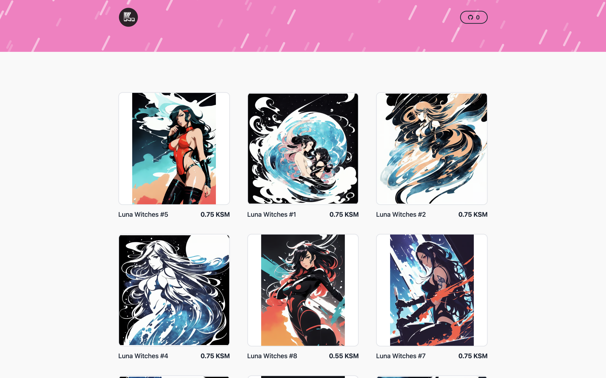

# Kodadot Fandom Shop

Built with [Deno](https://deno.land/) and
[Fresh](https://fresh.deno.dev/), powered by [Uniquery](https://github.com/kodadot/uniquery) and deployed to the edge with [Deno Deploy](https://deno.com/deploy).

This app was built for showcasing [Uniquery](https://github.com/kodadot/uniquery), KodaDot's GraphQL API, for querying data from the blockchain. It's a simple shop that uses Uniquery to fetch NFTs from the blockchain via the [SubSquid indexer](http://subsquid.io).

## Screen Shot



## Getting Started

- Clone the repository
- Set up the `CHAIN` variable in the `.env,` follows `.env.example`.
- Set up the `COLLECTION_ID` variable in the `.env,` follows `.env.example`.
- Start the project in local mode:
```bash
npm run dev
# or
yarn dev
# or
pnpm dev
```

Open [http://localhost:3000](http://localhost:3000) with your browser to see the result.

## Check out this project using Deno
Check out how to implement this website using [Deno](https://github.com/vikiival/shop)

## Deploy on Vercel

The easiest way to deploy your Next.js app is to use the [Vercel Platform](https://vercel.com/new?utm_medium=default-template&filter=next.js&utm_source=create-next-app&utm_campaign=create-next-app-readme) from the creators of Next.js.

Check out our [Next.js deployment documentation](https://nextjs.org/docs/deployment) for more details.
